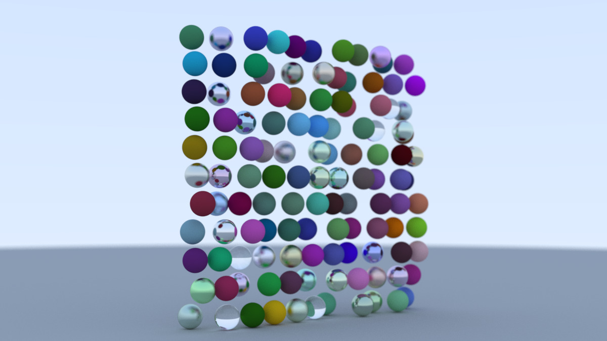

Adopted from [Ray Tracing in One Weekend](https://raytracing.github.io/books/RayTracingInOneWeekend.html)



# Usage:
```
make 
./main > output.ppm
```

A ppm file is an ASCII document defining pixel values. Most image displayers can display them. I'm sure there's a tool online to convert ppm to some other format where you can see it if yours doesn't.

# Summary
A Ray is a linear function (R1 -> R3) defined R(t) = v0 + td where v0 is the origin of the ray, and d is the directional component. You'd think the directional component is normalized, but in my case, it didn't need to be. You're more interested in if a ray intersects some object at all, and not "when" it intersects with respect to t. So in my case, t doesn't really matter (yet) and subsequently the magnitude of d doesn't matter.

The basic algorithm is:

1. For each pixel, N rays are emitted. These rays are defined such that v0 is the location of the eyes and d is pointed so that the ray intersects a random spot inside the given pixel (the randomness step is "antialiasing" where at the end, you average all the values you get and assign it to the pixel).

2. If a ray "hits" an object before it hits the pixel (where "hit" means the ray function intersects some object, able to be solved analytically in R3 in this first project of mine. I doubt that's always the case in the future), generate a new ray following certain rules depending on the material it hit:

In my code:
  - Metal := a ray is reflected such that the angle of incidence is equal to the angle of reflection (with some small fuzz to add randomness).
  - Diffuse := A ray is reflected with the angle of reflection taking a uniform distribution between 0 and 180
  - Lambertian := Like diffuse, but weight probabilities closer to the normal
  - Dielectric := Both reflection and refraction with rules based on refractive index
 
The rich logical properties of each material determines how rays "look" once they escape their ray "bounce-around" purgatory. As rays bounce around, they gather properties of each object. For example, if the ray hit two objects before going into the infinite universe, it would be the hadamard product of the two attenuations of the two materials with the final value of the "universe" color (which was just a simple gradient from blue to white in my case). As you could imagine, the algorithm, then, for determining the "color" of a ray is deeply recursive (with theoretically no limit).

3. Camera positioning is theoretically simple. It's just the original v0 and d of the rays. The challenge comes from defining a model that makes certain camera actions intuitive. 

I'm glossing over other concepts like blur, refraction, interior / exterior details, where Shirley's guide goes into excellent details about each of these concepts.
